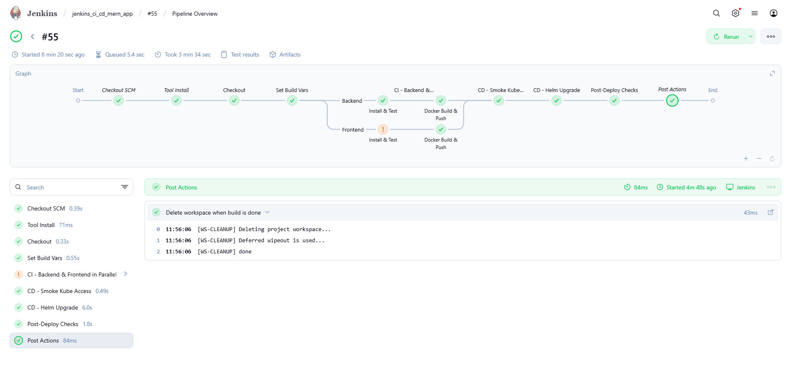
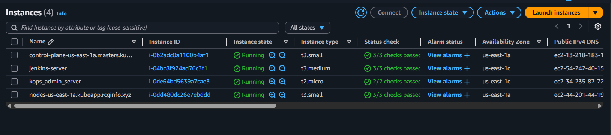
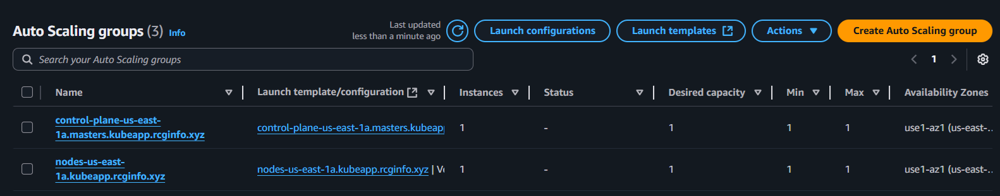
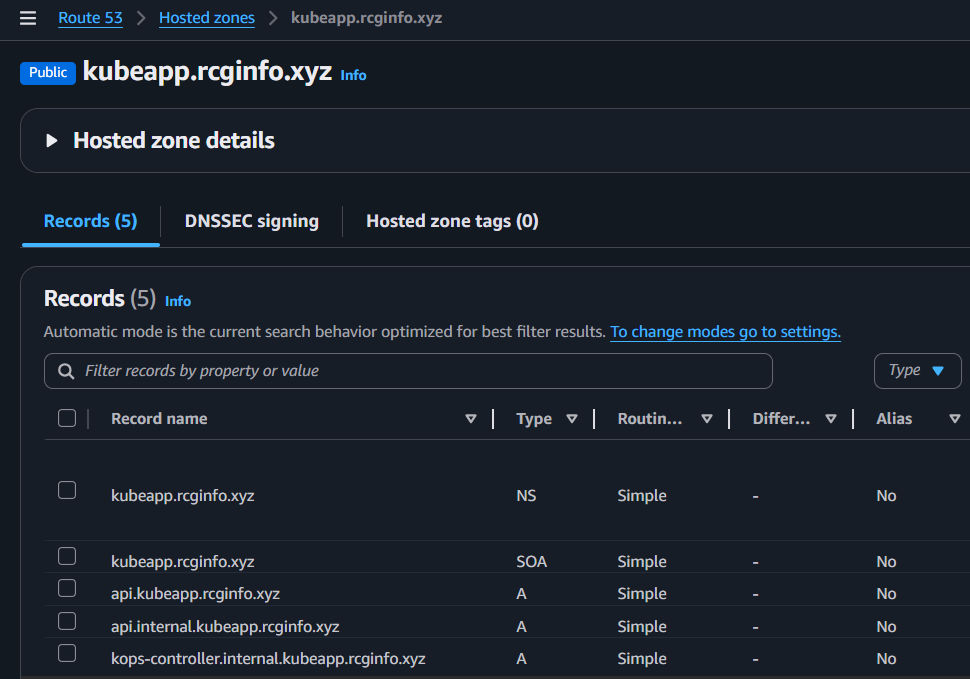
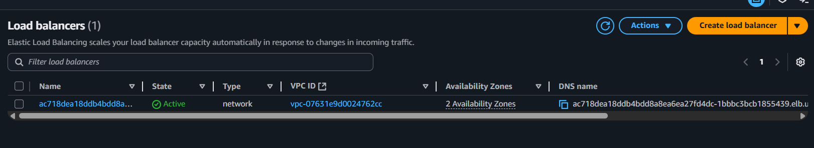
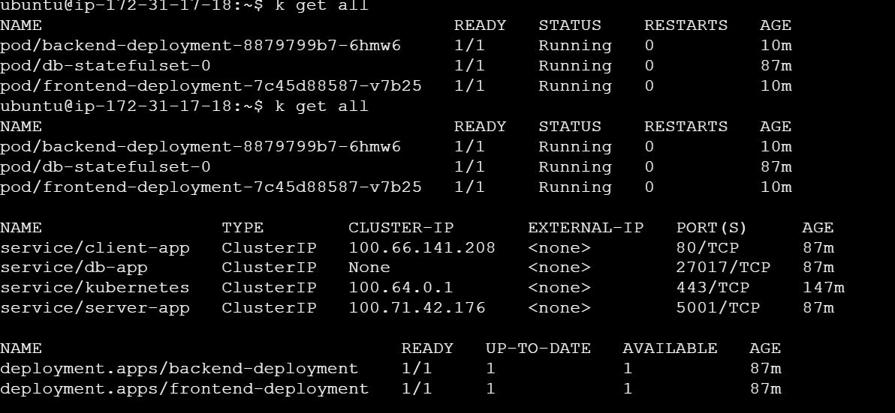
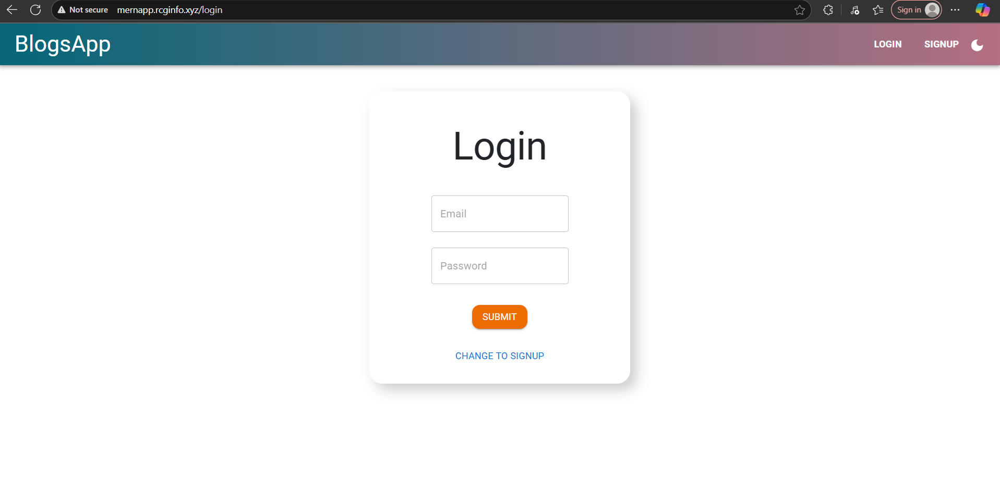
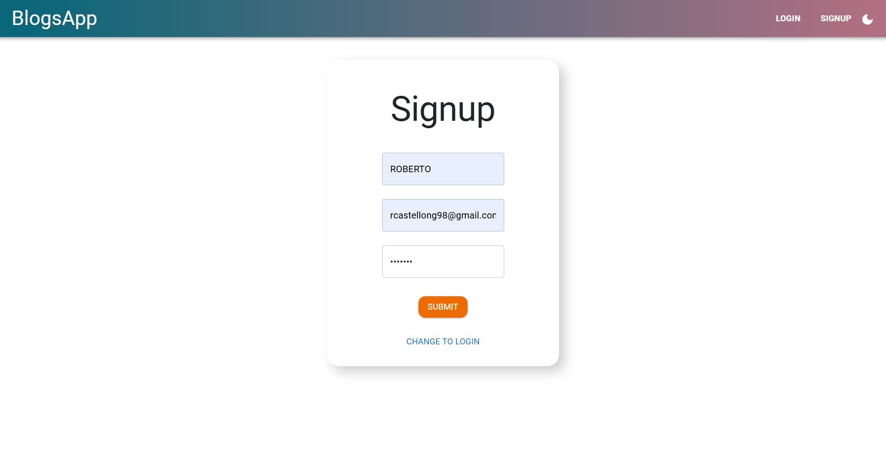
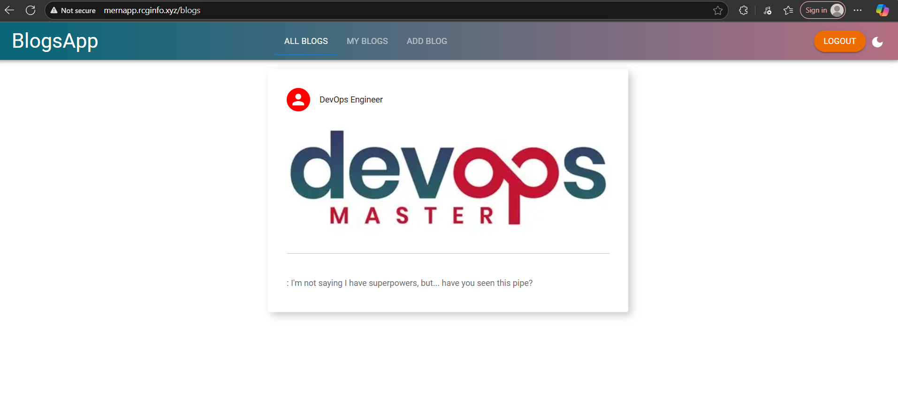
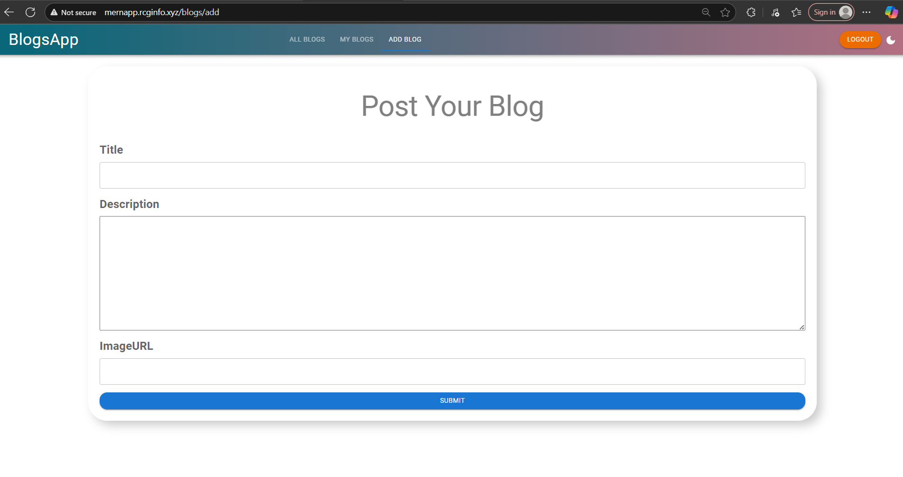

# 🧪 CI/CD Pipeline for MERN Application on AWS using Jenkins, Kubernetes and Helm

This project demonstrates a **complete DevOps CI/CD pipeline** for a real-world **MERN stack application**, deployed on **AWS** using **Jenkins**, **Kubernetes (via kOps)**, **Helm**, **Terraform**, and **Ansible**.

> 🚀 The application is live at: `http://mernapp.rcginfo.xyz`

---

## 📌 Project Overview

The goal was to simulate a **professional CI/CD workflow** from code push to production deployment, using modern DevOps practices and open-source tools.

We started with a full-stack blog app built on the **MERN stack** (MongoDB, Express, React, Node.js), one of the most in-demand web development stacks today.

---

## ⚙️ Technologies Used

| Layer              | Tools & Services                                    |
|-------------------|------------------------------------------------------|
| Version Control    | Git, GitHub                                          |
| CI/CD Pipeline     | Jenkins (Declarative Pipeline), GitHub Webhook      |
| Containerization   | Docker (with BuildKit cache)                        |
| Infrastructure     | AWS (EC2, Route53, ELB, Auto Scaling), S3, IAM      |
| Provisioning       | Terraform                                            |
| Configuration Mgmt | Ansible                                              |
| Kubernetes         | kOps, kubectl, Helm (for app deployment)            |
| Observability      | *To be added: Prometheus + Grafana*                 |
| App stack          | MERN (MongoDB, Express, React, Node.js)             |

---

## 🔁 CI/CD Pipeline Flow



1. **Code Push** triggers GitHub webhook → Jenkins
2. Jenkins **checks out** the branch and sets build variables
3. Runs **parallel stages**:
   - Backend: Install → Lint → Test (Jest) → Coverage
   - Frontend: Install → Lint → Test → Build → Archive
4. Builds Docker images for backend & frontend and pushes them to DockerHub
5. Applies **Helm upgrade** on Kubernetes cluster (only on `main` branch)
6. Performs post-deploy checks: rollout status, ingress, smoke tests, rollback if needed

---

## 🧱 Infrastructure on AWS

| Component           | Tool         | Screenshot                            |
|--------------------|--------------|----------------------------------------|
| EC2 + Jenkins       | Ansible      |      |
| Cluster w/ AutoScaling | kOps     |        |
| Hosted DNS Zone     | Route53      |        |
| Load Balancer       | ELB          |      |
| Pods & Services     | Kubernetes   |    |

---

## 🌐 Application Screenshots (Production)

| Home | Posts | Editor | Responsive |
|------|-------|--------|------------|
|  |  |  |  |

---

## 📁 Branch Index (deep dive into each area)

| Branch       | Description                                           |
|--------------|-------------------------------------------------------|
| [`main`](https://github.com/Roberto-1998/jenkins_ci_cd_mern_app/tree/main)       | 📌 High-level overview & final result |
| [`jenkins`](https://github.com/Roberto-1998/jenkins_ci_cd_mern_app/tree/jenkins)     | Jenkinsfile CI/CD explained in detail |
| [`helm`](https://github.com/Roberto-1998/jenkins_ci_cd_mern_app/tree/helm)        | Helm chart & Kubernetes manifests     |
| [`infra`](https://github.com/Roberto-1998/jenkins_ci_cd_mern_app/tree/infra)       | Terraform + Ansible + kOps setup      |

---

## 📦 Project Structure (simplified)
```bash
.
├── mern_blog_app/           # Full-stack application code (client + server)
├── infrastructure/          # Terraform + Ansible files for AWS + kOps
├── deploy/helm/mern         # Helm chart for Kubernetes deployment
├── Jenkinsfile              # CI/CD pipeline (declarative)
├── screenshots/             # Images used for README and documentation
└── README.md                # This file (high-level overview)
```

---

## 📚 How to Reproduce This Project

> Detailed instructions are available in each branch's README.

1. Clone this repository
2. Start from the `infra` branch to provision infrastructure with Terraform and kOps
3. Switch to `helm` to prepare Kubernetes manifests and Helm chart
4. Use `jenkins` branch to set up Jenkins server and pipeline
5. Merge into `main` and trigger the CI/CD workflow via GitHub push

---

## 👨‍💻 Author

**Roberto Castellón García** — DevOps & Cloud Engineer  
🔗 [LinkedIn](https://www.linkedin.com/in/roberto-castellon-garcia-3261ba190)  
💻 [GitHub](https://github.com/Roberto-1998)

---

> ✅ Project built with real tools, real infrastructure, and production-level architecture.
> Ideal to showcase hands-on DevOps skills and experience managing CI/CD pipelines with Kubernetes and Jenkins on AWS.